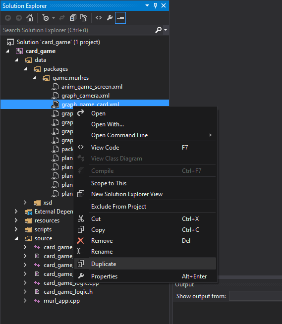
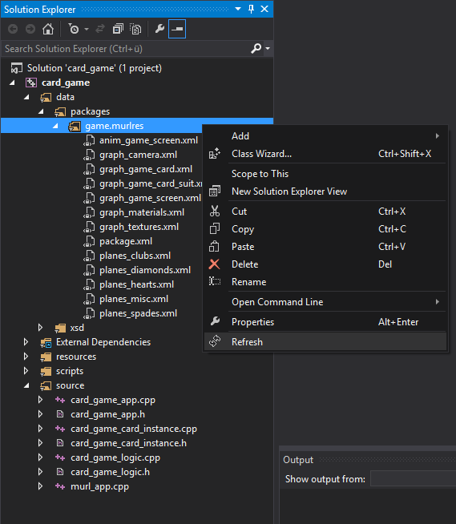
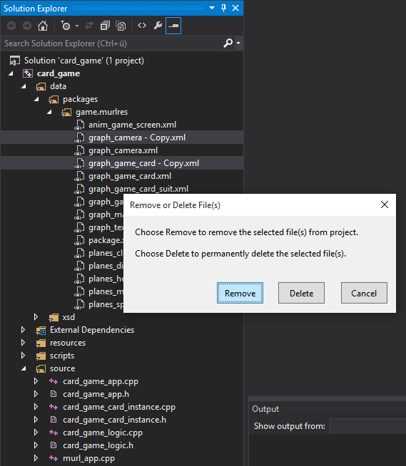

## Murl Tools
### A Visual Studio extension for VS2013 & VS2015

Download from the
[Visual Studio Gallery](https://visualstudiogallery.msdn.microsoft.com/TBD)

## Summary

This extension adds some useful commands to the Solution Explorer of Visual Studio. 
The extension has been made to improve the work flow with [Murl Engine](http://murlengine.com) projects but 
is beneficial for every cross platform VisualC project where the source and data files are not stored inside of the project folder.

The Murl Tools extension adds the following commands to the context menu of the Solution Explorer:
- "Duplicate" to create a copy of the selected file(s).
- "Refresh" to add missing files that exist in the folder (file system) but not in the selected filter (project).
- The extension additionally adds a Remove/Delete dialog when deleting files (VisualC/C++ projects only).

### Duplicate File(s)

To create a copy of an existing file in the Solution Explorer you usually select the file and press CTRL-C and CTRL-V.
While this is working for C# and VB projects, it does not work for VisualC/C++ projects.

The extension adds a Duplicate command to the context menu of the Solution Explorer.
The command creates a copy of the selected file and adds it to project within he same filter group.

Side note: If you want the CTR-C / CTRL-V feature in Visual Studio, you can vote for it [here](http://visualstudio.uservoice.com/forums/121579-visual-studio/suggestions/9145699-solution-explorer-should-support-ctrl-c-ctrl-v-in).

### Refresh Folder

This command adds references for all missing files that exist in the folder (file system) but not in the selected filter (project).
Note, that this command only makes sense when your filter hierarchy matches to real folders in the file system.

### Remove/Delete Dialog

If someone selects one or more files in the solution explorer of a VisualC/C++ project and then presses the delete key, he usually will get a dialog where he can choose to remove or to delete the file(s).
You can decide if only the file reference(s) should be removed from the project or if also the file(s) itself should be permanently deleted in the file system.
Unfortunately the dialog only shows up if the selected files are stored inside of the project folder which is not the case for e.g. cross platform projects where multiple projects/platforms share the same source code files.

The extension fixes this weird behavior and always displays a Remove/Delete dialog.

Side note: If you want this feature fixed in Visual Studio, you can vote for it [here](http://visualstudio.uservoice.com/forums/121579-visual-studio/suggestions/9146353-remove-delete-dialog-should-show-up-when-deleting).

### Support or Contact

Having trouble with the extension? Check out our [forum](http://murlengine.com/forum) or contact us per [email](spraylight.at/?splpage=contact).
